# Setting a Linux Development Environment in Windows 10

## 1. Install Windows Subsystem for Linux

### a) Turn on developer setting

- **Search for "developer settings" at the Windows search bar.**
    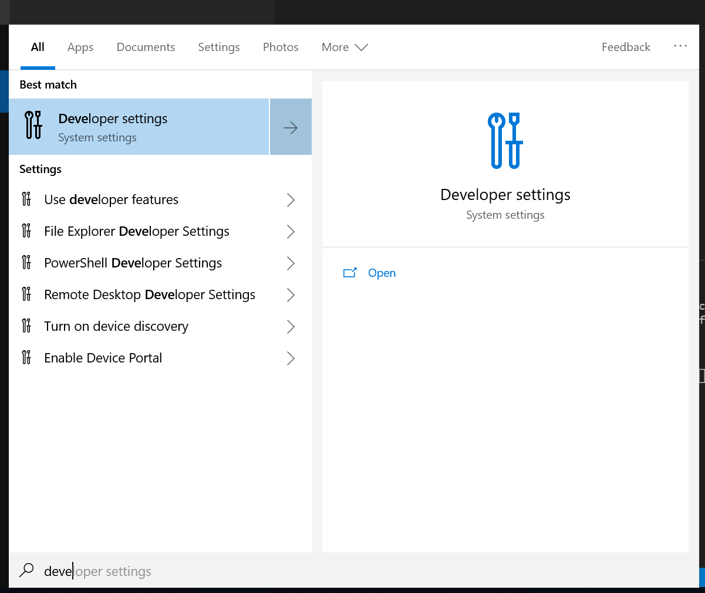
- **Select developer mode.**
    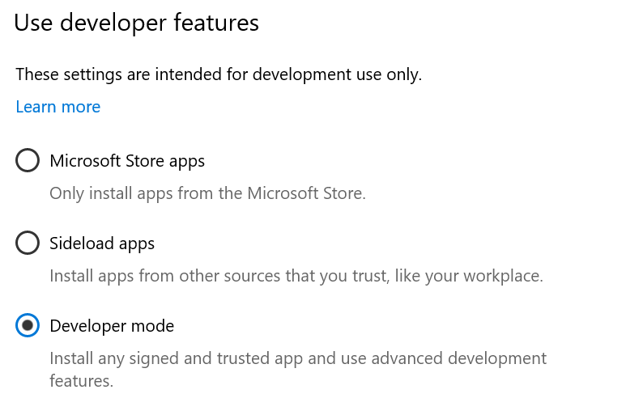
    **Restart when finish downloading packages.**

### b) Install Windows Subsystem for Linux (WSL)

- **Search for "ubuntu" at the Windows search bar and download it through the app store.**
    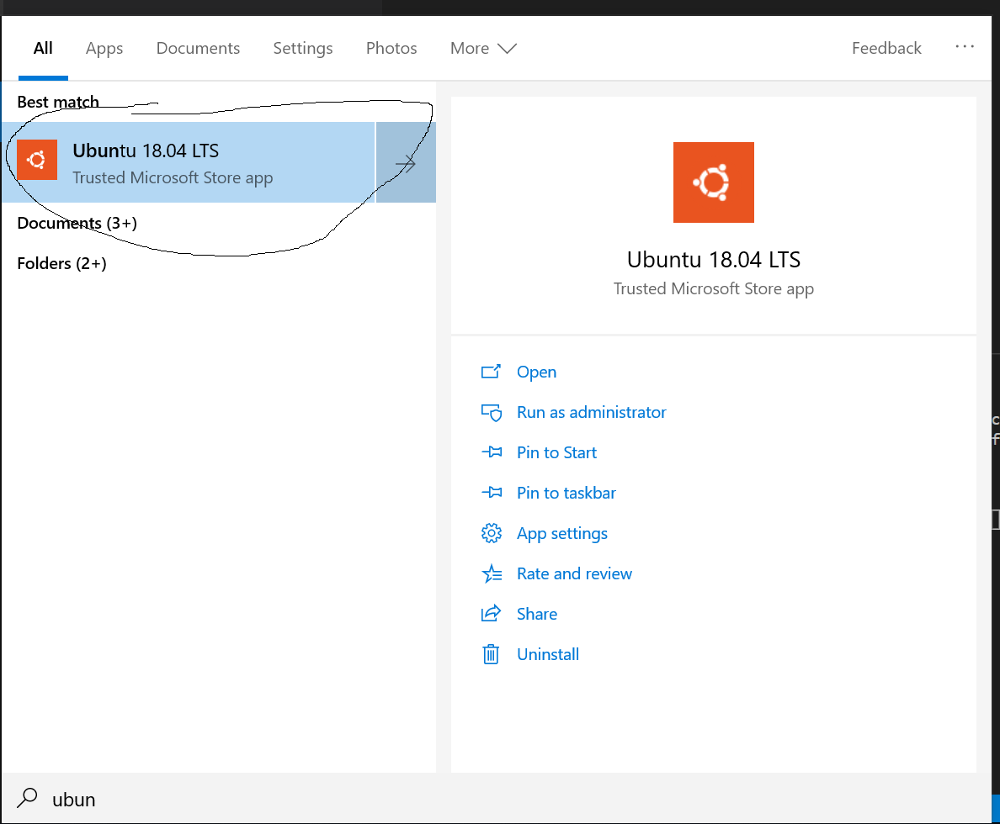

    - **Alternatively you can manually download wsl by following this [link](https://docs.microsoft.com/en-us/windows/wsl/install-manual)**
- **After download is completed, search for "ubuntu" app in the search bar again and run it. This should prompt a terminal window for installation. The process should take a few minutes.**
- **After installation is complete, configure a local use and password for your machine.**
    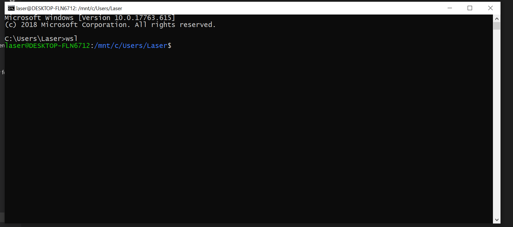
- **To run wsl, search for "ubuntu" in the search bar or run "wsl" in a CMD.**

## 2. Install VScode
- **Download VScode from the [link](https://code.visualstudio.com/)

## 3. Bridge VScode with the WSL
### a) Set WSL as the default terminal instance

- **Open VScode and turn on a terminal**
    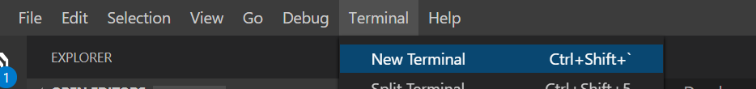
- **On the right side of the terminal, click the drop down and select "select default shell".**
    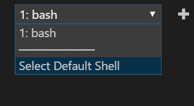
- **Select wsl as the default shell.**
- **Now every new terminal will be a wsl instance.**

### b) Install bridging extension

- **Open extension tab, search for "remote development" and install it.**
    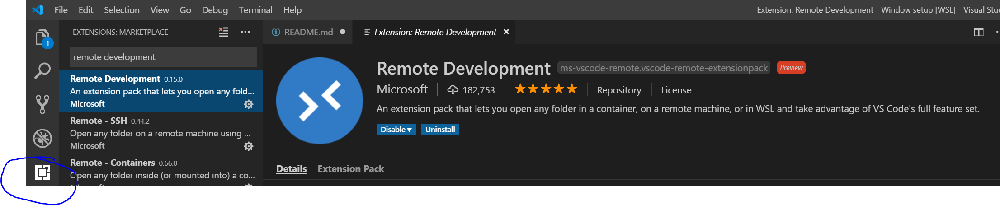
- **Open a terminal in VScode and run:  `code .`**
    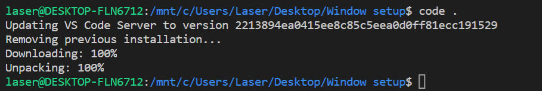
- **This should open a new window connecting to the wsl instance**
    

### c) Install python extension in VScode

- **In VScode extension tab, search for "python" and install it on wsl.**
    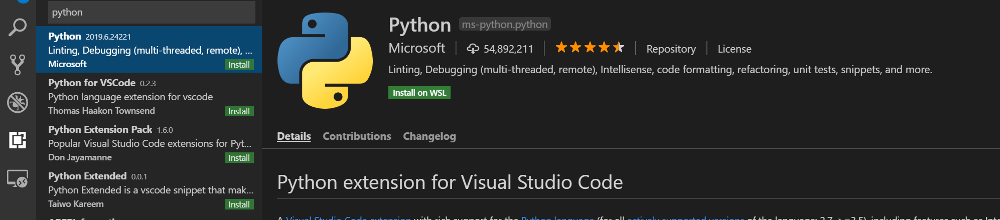
- **Reopen VScode to activate the extension.**
- **Press `Ctrl+p` to bring up control prompt.**
- **Enter `>python: select interpreter`.**
- **VScode should automatically detect the python pre-installed in wsl.**
    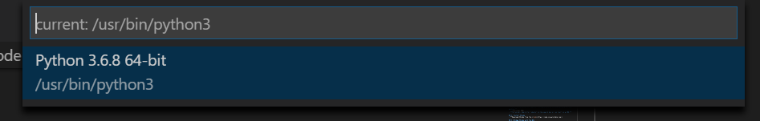
- **Now you can run any python script by right clicking the document or run in the terminal.**
    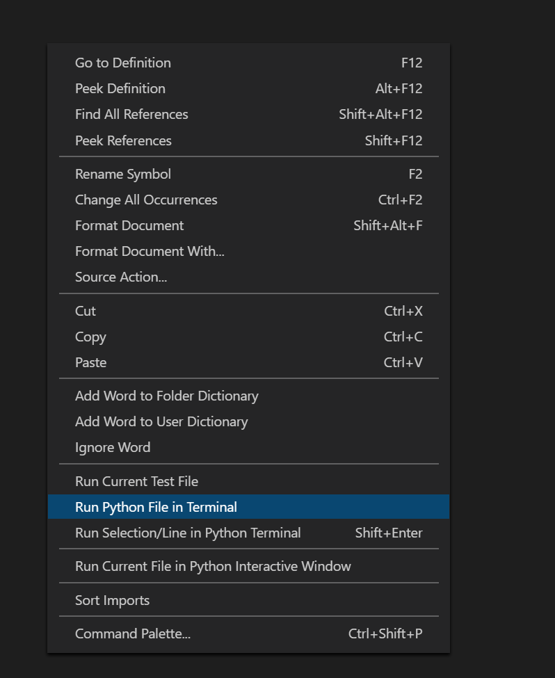

### d) Install pylint

- **In wsl terminal, install pip: `sudo apt install python3-pip`.**
- **Install pylint: `sudo pip3 install pylint`.**
- **In VSCode, press `Ctrl+p` to bring up control prompt.**
- **Enter `>python: select linter` and select pylint.**

You can also install IDE extension (linting, etc) for other programming languages in the similar fashion.